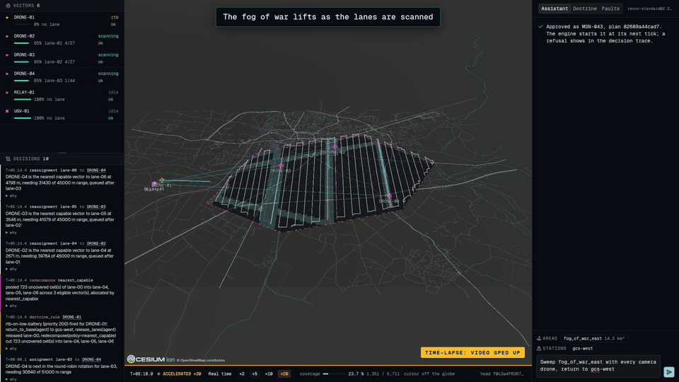
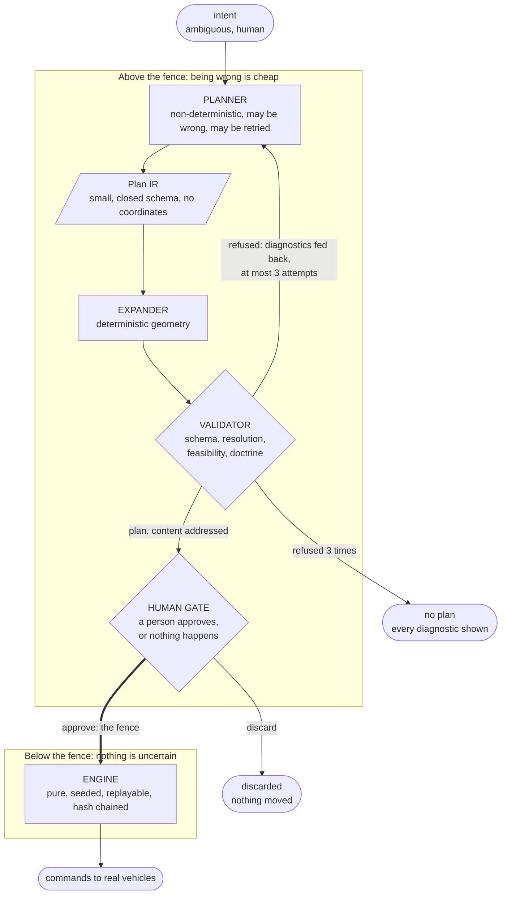
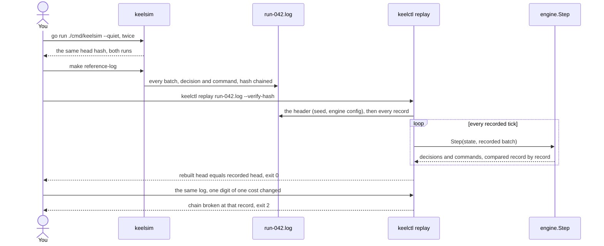
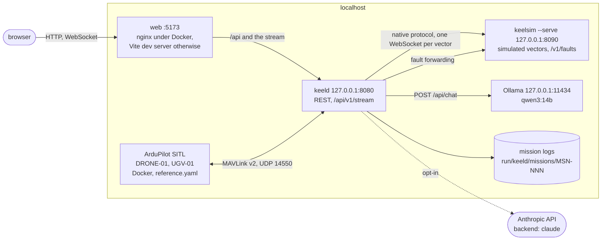
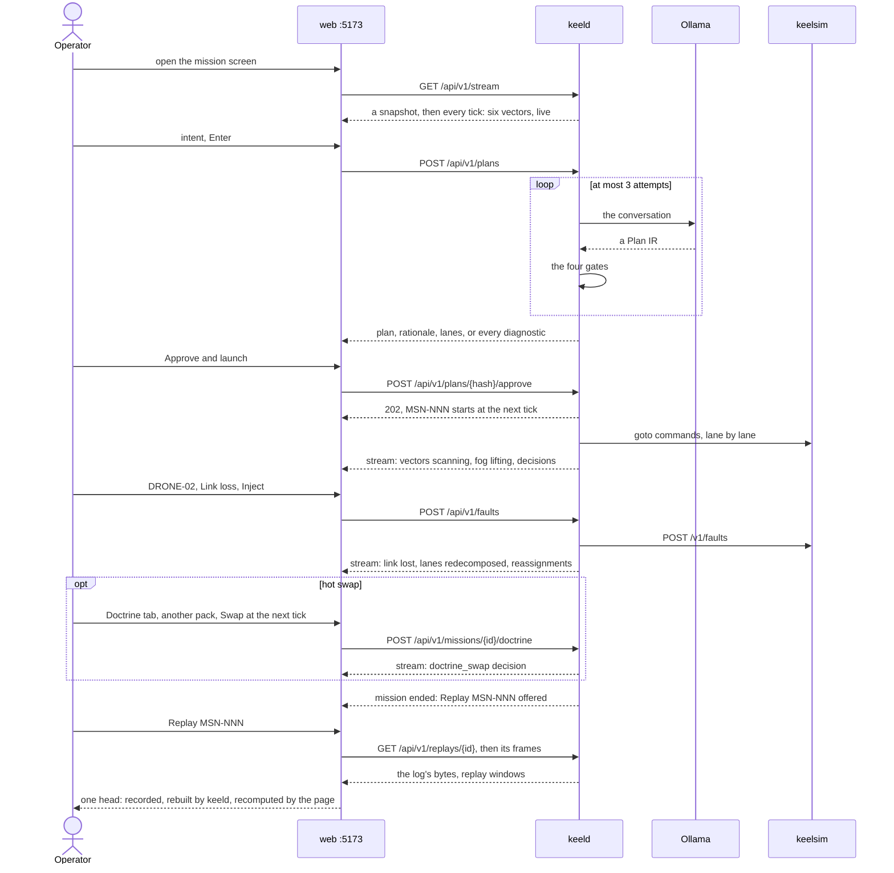

# KEEL

KEEL compiles an operator's intent, written in plain language, into a mission plan for a fleet of heterogeneous autonomous systems (aerial and ground) running systematic reconnaissance of an area, where links drop and vehicles fail. A language model proposes the plan; code expands it into geometry, validates it against a versioned doctrine and shows it to a human, who approves it or not. Everything after that approval is deterministic: the same seed and the same events produce byte-identical decisions, chained under SHA-256, and a replay proves it.



*A link loss on DRONE-02, the fleet at ×20 under Docker. The two-minute demo, from the intent to the replay's three matching heads, is recorded through the UI by `make demo-video`.*

## An intent compiler, fenced

A language model is non-deterministic by construction, so KEEL uses it as a compiler frontend: it sits where being wrong is survivable, and it is fenced out of everything that moves a vehicle.



Above the fence, a mistake costs a rejected plan: the validator names what is wrong, the repair loop retries at most three times and never relaxes a constraint, the operator discards what remains. Below it, nothing is uncertain. Three properties make the fence structural rather than rhetorical:

1. **Plan IR cannot express a coordinate.** Not "the model is told not to emit one", but "no field can hold one". `mission.area` is the name `fog_of_war_east`, resolved server side against a registry. An unknown name is a validation failure, never an improvisation.
2. **The model chooses the tactic, code computes the geometry.** The model emits four scalars (pattern, orientation, lane count, overlap) and a rationale. `coverage.Decompose` emits the waypoints.
3. **A human approves.** The plan is content addressed and drawn on the globe for inspection before anything moves.

The planner runs on a local model through [Ollama](https://ollama.com) by default (`qwen3:14b`), Claude on request. If the system is safe with a small local model, safety is a property of the validator and the gate, not of the model.

## Deterministic, and checkable

The engine is one pure function, `Step(state, events) -> (state, commands, decisions)`: no wall clock, no map iteration, no goroutine, randomness from a seed carried in the state. The daemon owns the loop and records every batch of events as `Step` received it, every decision with its full rationale (every candidate vector, the rejected ones with their reason, every doctrine rule that fired or was shadowed) and every command, each record hash-chained to the one before. Replay is the same `Step` fed the recorded events, not a second implementation.

Checking it takes a clean clone and no credentials:

```sh
# The reference mission, headless: run it twice, read the same head hash.
go run ./cmd/keelsim --quiet

# Record it (62 MB in about a second, never versioned: the seed rebuilds it byte for byte),
# then replay the recording through the engine, verifying every record.
make reference-log
go run ./cmd/keelctl replay examples/replays/run-042.log --verify-hash

# Change one digit of one recorded cost: the chain breaks at that record (exit 2).
sed '10s/2647.5319048288243/2647.5319048288244/' examples/replays/run-042.log \
  | go run ./cmd/keelctl replay - --verify-hash

# The reference mission against its chain pinned every 100 s (cmd/keelsim/testdata),
# repeated seeded runs, and a sweep of the fault-injecting harness.
go test ./cmd/keelsim -run TestReferenceReplay -count=1
go test ./internal/engine -run TestDeterminism -count=1
go test ./internal/engine -run 'TestDST$' -count=1 -dst.seeds=64
```

What those commands exercise:



In the browser, the replay route (`/replays/MSN-042` after `make demo-replay`) redraws the mission from keeld's replay while a worker recomputes the chain from the log's bytes; at the end, the recorded head, keeld's rebuilt head and the page's own are one value.

The DST harness runs the reference mission under seeded faults (kills, link loss, battery drains, GPS drift, dropped, duplicated, delayed and reordered telemetry, hot doctrine swaps), asserts invariants I1 to I9 at every tick boundary and prints the command reproducing any failing seed. [`docs/determinism.md`](docs/determinism.md) walks through each mechanism, where it is enforced and what the claim does not cover.

## Why "keel"

The keel is the backbone of a hull. It is not what steers the vessel, it is what holds a course: the structural member that keeps a heading stable when the sea is not cooperating. That is the role of this layer. The rudder is elsewhere (the operator, the model, the vehicles), and the keel is the part that makes their combined behaviour predictable.

## Prerequisites

- Go 1.26 or later.
- pnpm, for the frontend. The workspace pins pnpm 12.4.1 and Node 24 (`devEngines` in `package.json`), and pnpm downloads either when the one running differs.
- Docker with Compose v2, for the one-command startup.
- A planner, to compile intents: [Ollama](https://ollama.com) serving `qwen3:14b` (the default, local, no credential), or Claude with `ANTHROPIC_API_KEY` set and `planner.backend: claude` in the keeld configuration (`--backend claude` for `keelctl plan compile`). The simulator, the replays and every test above need no planner.

The globe runs offline: no Cesium ion token, no tile server. It draws an OpenStreetMap vector extract of the reference area over Cesium's bundled imagery and the ellipsoid ([ADR 0006](docs/decisions/0006-offline-cartography-without-cesium-ion.md)). Map data © OpenStreetMap contributors, under the [ODbL](https://opendatacommons.org/licenses/odbl/1-0/).

## Build

```sh
make build        # keeld, keelctl, keelsim into ./bin, version and commit stamped
make test         # full Go test suite
make lint         # golangci-lint, including the forbidigo determinism rules
make check-sdk    # regenerate the TypeScript wire types, fail on a non-empty diff
make web-install  # pnpm workspace dependencies
make web-lint     # typecheck and lint, frontend and SDK
make web-test     # frontend and SDK test suites
```

## Run

Three steps: start the planner's model, start KEEL (with Docker, or without), then fly a mission from the browser. Every command runs from the repository root.

What runs, and who calls whom:



Under Docker the mission logs live in the `keel-run` volume. With `examples/keeld/keelsim.yaml`, keelsim serves all six vectors and no SITL runs.

### Step 1: start the planner (Ollama)

Only compiling an intent needs a planner. The fleet, the replays and the tests run without one, so this step can wait if you only want to look around.

```sh
curl -fsSL https://ollama.com/install.sh | sh   # Linux; macOS and Windows: https://ollama.com/download
ollama serve                                     # only if no Ollama runs yet (the Linux installer starts a systemd service)
ollama pull qwen3:14b                            # the default model, fits in 16 GB of VRAM
curl -s http://127.0.0.1:11434/api/tags          # must list qwen3:14b: this is the address keeld calls
```

The first compilation loads the model into memory and is the slowest. One compilation, its repair attempts included, is bounded at 5 minutes (`planner.timeout_ms` in the keeld configuration). The model replies without thinking first, which divides the time of a call by about three on `qwen3:14b`; `planner.think: true` in the keeld configuration (`--think` for `keelctl plan compile`) turns thinking back on, for a better first attempt at the price of latency.

Ollama on another machine (a GPU host): start it there with `OLLAMA_HOST=0.0.0.0:11434 ollama serve`, then `export OLLAMA_HOST=http://<gpu-host>:11434` in the shell that starts keeld or `make docker-up`, or set `planner.ollama_url` in the keeld configuration. Ollama's API has no authentication: expose it on a trusted network only.

Claude instead of Ollama: `export ANTHROPIC_API_KEY=...` and set `planner.backend: claude` in the keeld configuration.

### Step 2, with Docker: one command

```sh
make docker-up        # docker compose up --build, images stamped with version and commit
```

Brings up two ArduPilot SITL autopilots (DRONE-01, UGV-01), `keelsim` serving the four other vectors, `keeld` driving all six and the web UI, on the host network (Linux, or Docker Desktop with host networking enabled). The first run builds the images; later runs reuse them. keeld dials keelsim until it answers and hears each SITL once it boots, so no start order is needed.

- The interface: <http://localhost:5173>, the API behind it.
- The reference mission, recorded when keeld's image is built, is already there as a finished mission: <http://localhost:5173/replays/MSN-042>. The first live mission is MSN-043.
- keeld reaches the host's Ollama on `127.0.0.1:11434` (host network), or `OLLAMA_HOST` when set.
- `Ctrl+C` stops the stack; `make docker-down` also deletes the recorded missions.

### Step 2, without Docker: three terminals

Every vector simulated by `keelsim`:

```sh
make build && make web-install                                    # once
make demo-replay                                                  # optional: the reference mission as MSN-042, before keeld starts

./bin/keelsim --scenario examples/sims/reference.yaml --serve     # terminal 1: the six vectors, on 127.0.0.1:8090
./bin/keeld --config examples/keeld/keelsim.yaml                  # terminal 2: API and stream, on 127.0.0.1:8080
pnpm --filter @keel/web dev                                       # terminal 3: the interface, on http://localhost:5173
```

keeld numbers missions from the directories it finds at startup, hence `make demo-replay` before it. The dev server forwards `/api` and its WebSocket to keeld on `127.0.0.1:8080`; `KEELD_URL` points it elsewhere. Missions are recorded under `run/keeld/missions/`.

With DRONE-01 and UGV-01 on ArduPilot SITL instead, start `docker compose up sitl-copter sitl-rover` and run `keeld --config examples/keeld/reference.yaml`. The configuration format is `spec.md` section 16.

### Step 3: fly a mission from the web interface

Open <http://localhost:5173>. **The Assistant is not a chat.** It compiles a reconnaissance of an area into a plan, and nothing else: it answers no question and runs no command. *Check the fleet*, *status* or *hello* ask for no mission, and the answer, in about a second, is *Not a mission* with the model's reason.

Your first mission, from a fresh start:

1. **Wait for the fleet, without typing anything.** Under the globe, the time strip reads `live`; in the left column, the **Vectors** roster lists six vectors (DRONE-01 to DRONE-04, RELAY-01, UGV-01), all `idle`. Under Docker, DRONE-01 and UGV-01 are listed at once as `waiting`, with their autopilot's reason (*no absolute position estimate*), and join about 40 s after the SITL boots, once ArduPilot's EKF knows where they are: only then are they drawn on the globe.
2. **Type a mission in the Assistant**, the bar at the bottom of the right column (its placeholder is this very example), then press `Enter`:

   ```text
   Sweep fog_of_war_east with every camera drone, return to gcs-west
   ```

   A mission names the area to cover and, optionally, which vectors fly it and the station they return to. Above the bar, the Assistant lists the world's areas and stations: click one to insert its name at the caret (an area also brings the globe over it, where every area is outlined). The reference world has one area, `fog_of_war_east`, and one station, `gcs-west`. Names only, never coordinates.
3. **Wait for the plan.** *Compiling intent* spins while the model checks that the text asks for a mission, then writes the plan, and keeld validates it, sending any refusal back for repair. With `qwen3:14b` on a 16 GB GPU, expect about 5 s for a plan accepted at the first attempt, a few seconds more per repair, and a few more for the first compilation after the model was unloaded (Ollama unloads it after 5 minutes idle). The limit is 5 minutes.
4. **Approve and launch**, under the plan. The mission gets its number, MSN-043 for the first one under Docker, and the vectors set off.
5. **Speed it up.** The mission lasts about 38 minutes of real time. Click **×20** on the time strip: keeld, keelsim and both SITL run twenty times faster, the strip turns amber and reads *Accelerated ×20*, and the mission completes in about two minutes. **Real time**, the ladder's first rung, brings everything back.
6. **Break something.** Click DRONE-02 in the roster, open the **Faults** tab of the right column, choose **Link loss** with a duration of 60 s, inject it, and watch the remaining vectors take over its lane, then DRONE-02 rejoin. Lost for the rest of the run early in the mission, it leaves two camera drones under Docker (DRONE-01, a SITL on ArduPilot's own battery model, comes home on low battery after about five minutes), which lack the range for what remains: the engine then fails the mission on its stall rule, the honest verdict (`spec.md` section 5.7).

What the screen shows at each of these steps, and what comes after (doctrine hot swap, replay), is detailed below.

#### The screen

Three columns around a globe that nothing covers:

- **Left**, what you watch: the **Vectors** roster (mode, link, battery, lane and progress, time since last heard) above the **Decisions** trace, the separator between them dragged to give either more room.
- **Centre**: the globe, the fog of war over what is still unexplored, and the time strip under it (mission time, stream state, the pace, coverage, position under the cursor, head of the hash chain).
- **Right**, what you act with: the **Assistant**, **Doctrine** and **Faults** tabs, the active doctrine pack and its hash in their header.

#### The walkthrough, in detail

The requests each step makes (the full sequences are in [`design.md`](design.md), sections 2.2, 3.2, 3.3, 6.3 and 8.2):



Then, in order:

1. **The fleet is live** (nothing to type). The time strip reads `live` and the roster lists six vectors, DRONE-01 to DRONE-04, RELAY-01 and UGV-01, all `idle`. `connecting to keeld` means keeld is not reachable; a vector listed as `waiting` is bound but has sent no usable frame yet, its adapter's reason beneath it (under Docker, a SITL still booting, or its EKF still converging, about 40 s).
2. **State the intent.** In the Assistant tab, type in the bar at the bottom, naming the area and the station defined by the world, listed above the bar (a click inserts a name): *Sweep fog_of_war_east with every camera drone, return to gcs-west*. `Enter` compiles, `Shift+Enter` breaks the line. The area is named, never drawn: an unknown name is refused, and the diagnostic lists the known ones. Text that asks for no mission (a question, a request for status) is declined before any plan is attempted: *Not a mission*, with the model's reason.
3. **Read the plan.** The assistant shows the area, the doctrine pack pinned by hash, the tactic (pattern, orientation, overlap), swath and altitude, the required capabilities, the plan hash, the model's rationale and one row per lane with its steps, cells and assigned vector (`none`, in amber, when no vector can take it). The **Plan IR** tab is what the model wrote, **Expanded** is what the code computed from it, and the proposed lanes are drawn on the globe. Attempts the validator refused are listed with their diagnostics. *No plan: the validator refused every attempt* is the fence doing its job, not a failure of the demo: the intent stays in the bar, refine it and compile again.
4. **Approve or discard.** **Approve and launch** answers *Approved as MSN-NNN* and the engine starts the mission at its next tick; a refusal by the engine shows in the decision trace. **Discard** drops the plan: nothing has moved.
5. **Watch it run.** Vectors go from `transit` to `scanning`, the fog lifts cell by cell and the coverage readout climbs. The ladder on the time strip (**Real time**, **×2**, **×5**, **×10**, **×20**) sets the pace of the whole simulated loop, keeld and every simulator together; the strip stays amber and reads *Accelerated ×N* while the fleet runs faster than real time. The pace changes when ticks run, never what they decide: the log and its replay are the same at any pace. A fleet holding a vehicle no simulator paces keeps real time, the ladder then disabled with keeld's reason. The trace lists each decision, newest first, with its rationale; **why** opens everything behind it: every candidate vector with its cost, the rejected ones with their reason, the doctrine rule that fired and the rules it shadowed. Clicking a vector, in the roster or in the trace, flies the globe to it and keeps the trace to its decisions; the chip in the Decisions header clears that filter.
6. **Inject a fault.** Select DRONE-02, in the roster or among the vectors of the **Faults** tab: the tab offers **Kill**, **Link loss**, **Battery drain** (percent), **GPS drift** (m/s) and **Stale telemetry**, the timed ones taking a duration in seconds (0 for the rest of the run). Choose Link loss, inject it: *Accepted: injected at the next tick*. DRONE-02 falls silent in the roster, the trace records the engine's reaction and the globe redraws the lanes among the vectors left. Only the vectors keelsim serves take faults: under Docker, DRONE-01 and UGV-01 are SITL autopilots and keeld refuses the fault with its reason.
7. **Hot swap the doctrine** (optional, mission running). The Doctrine tab shows the active pack and every registered one (`recon-standard` 2.0.0, 2.1.0, 2.2.0). Select another: the panel shows what changes, parameter by parameter and rule by rule. **Swap at the next tick** applies it without stopping the mission; the `doctrine_swap` decision in the trace lists the duration windows kept and dropped.
8. **Replay it.** Once the mission has ended, the time strip offers **Replay MSN-NNN** (any finished mission also opens at `/replays/<id>`, such as `/replays/MSN-042`). The same three columns are fed by keeld's replay instead of the live stream, with play, pause, reverse, a speed ladder and a scrubber on the time strip. On the right, the page recomputes the hash chain from the log's bytes while keeld runs the log through the same `Step` again; at the end, *The replay reproduces the recording: one head* means the recorded head, keeld's rebuilt head and the page's own are one value.

### From the command line

The command line reaches the same pieces without the UI:

```sh
keelctl plan compile "Grid-search the unexplored area to lift the fog of war"
keelctl vector validate --native ws://127.0.0.1:8090/v1/vectors/DRONE-02 --allow-motion
keelctl doctrine diff examples/replays/run-042.log recon-standard@2.1.0 recon-standard@2.2.0   # after make reference-log
```

## Integrating a vehicle

A vehicle joins KEEL through one contract, the `Vector` interface, and is trusted once it passes nine conformance cases (capability honesty, idempotent commands, timeouts, reconnection among them) run by `keelctl vector validate`, which brings its own fault-injecting proxy. Two adapters ship: KEEL's own JSON-over-WebSocket protocol, which any vehicle or bridge can serve in any language, and MAVLink v2 straight to ArduPilot. [`docs/integration.md`](docs/integration.md) is the integrator's guide.

## Layout

```
keel/                             module github.com/dsanchez31/keel
├── cmd/
│   ├── keeld/                    orchestrator daemon
│   ├── keelctl/                  CLI: plan, vector, replay, doctrine
│   └── keelsim/                  simulator
├── internal/                     not importable
│   ├── engine/ coverage/ assign/ doctrine/        the decision path: pure, no I/O
│   ├── domain/ planir/ planner/                   types, Plan IR and validation, LLM backends
│   ├── eventlog/ missionlog/                      hash-chained log, mission layout and replay
│   ├── daemon/ transport/ httpjson/ strictjson/   keeld, REST and WebSocket, strict JSON
│   ├── world/ pacer/ conformance/                 simulator, tick pacing, adapter suite
│   └── files/ buildinfo/
├── vector/                       public: the Vector interface and the adapter toolkit
├── adapters/
│   ├── native/                   JSON over WebSocket, both sides
│   └── mavlink/                  MAVLink v2 over UDP, and a fake ArduPilot for tests
├── tools/sdkgen/                 TypeScript wire types generated from the Go types
├── doctrine-packs/               shipped doctrine YAML, loaded at runtime
├── examples/                     worlds, plans, scenarios, keeld configurations
├── build/                        Dockerfiles
├── docs/                         determinism.md, integration.md, decisions/
├── web/                          React 19 + Cesium         (workspace member)
├── sdk-ts/                       @keel/sdk                 (workspace member)
├── docker-compose.yml  Makefile  .golangci.yml
└── README.md  spec.md  design.md  LICENSE  go.mod
```

`internal/` holds the entire decision path, so the purity rule is enforced by the compiler rather than by review. Public packages sit at the module root rather than under `pkg/`, per `go.dev/doc/modules/layout`.

## Documentation

- [`spec.md`](spec.md): what KEEL does. Normative. Domain model, Plan IR schema, doctrine grammar, `Vector` contract, wire protocol, canonical encoding, invariants I1 to I9, conformance cases C1 to C9.
- [`design.md`](design.md): how and why. Component boundaries, the LLM fence, the determinism mechanism, technology rationale, known limitations.
- [`docs/determinism.md`](docs/determinism.md): the determinism claim, and how to check it yourself.
- [`docs/integration.md`](docs/integration.md): integrating a vehicle and passing the conformance suite.
- [`docs/decisions/`](docs/decisions/README.md): architecture decision records.

## License

MIT. See [`LICENSE`](LICENSE). The OpenStreetMap extract in `web/public/basemap/` is under the ODbL.
