# KEEL Design

Version 0.1.0, status: draft.

`spec.md` defines what KEEL does. This document explains how it is built and why it is built that way.

---

## 1. The problem

Orchestrating a fleet of heterogeneous autonomous systems has three properties that most software does not:

1. **The operator's input is ambiguous.** "Grid-search the unexplored area" is intent, not a plan. Something has to turn it into waypoints.
2. **The environment is hostile to the software.** Links drop, batteries die, vehicles stop answering. Failure is the normal case, not the exception.
3. **The consequences are real.** A wrong decision moves physical vehicles. "It usually works" is not an acceptable property.

Property 1 pulls toward a language model. Properties 2 and 3 pull toward determinism and reproducibility. Those pull in opposite directions, and the entire design of KEEL is the resolution of that tension.

---

## 2. The central argument: the LLM is a compiler frontend

A language model is non-deterministic by construction. Sampling, batching and model updates all mean the same input can yield different output. That is acceptable in a system that suggests, and unacceptable in a system that acts.

The resolution is not to avoid the model. It is to **put it where non-determinism is survivable**:

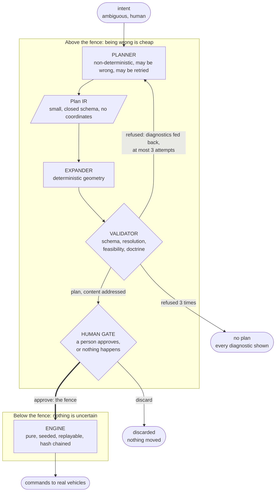

Above the fence, being wrong is cheap: the validator rejects it, the repair loop retries it, or the operator discards it. Below the fence, nothing is uncertain: the same inputs always produce the same decisions, and the hash chain proves it.

Three properties make the fence real rather than rhetorical:

**The Plan IR cannot express a coordinate.** Not "the model is instructed not to emit coordinates", but "the schema has no field capable of holding one". `mission.area` is the string `fog_of_war_east`, resolved server side against a registry. An unknown name is a validation failure. A model that hallucinates an area name produces a rejected plan, never a mission over the wrong ground.

**The model chooses tactics; code computes geometry.** The model decides *four lanes, north-south, fifteen percent overlap*. `coverage.Decompose` decides where those lanes actually are. Lane geometry is therefore a pure function of the AO polygon and four scalars, and is identical on every run and every machine. Section 5 covers why this specific split.

**A human approves.** The plan is content addressed and rendered for inspection before anything moves. This mirrors LE_VECTOR's own `LANCER MISSION` gate, and it is the correct design independent of that: a system that acts on model output without review has no meaningful safety story.

### 2.1 Why the backend is pluggable, and why the default is local

`Planner` is one interface with two implementations:

```go
type Planner interface {
    Name() string
    Propose(ctx context.Context, c Conversation) (string, error)
}

func Compile(ctx context.Context, p Planner, in Input) (Outcome, error)
```

A backend is a transport and nothing more. It receives a `Conversation` (system prompt, turns, model schema) and returns the model's reply as **raw text**, not a decoded `planir.Plan`: gate 1 has to see the bytes the model produced, or an unknown field or a wrong type would vanish in a decoder before the validator could name it. The prompt is built once, in `internal/planner/prompt.go`, so both backends see byte-identical conversations and a difference in outcome is a difference in the model. `Compile` owns the triage and the repair loop and is the only entry point callers use.

**Triage before planning.** Every text typed in the assistant used to be compiled into a plan: *check the fleet* took three refused attempts, and once the model schema required a full tactic it produced a one-lane plan that passed every gate. A declared refusal as an `anyOf` branch of the plan schema was measured first and dropped: Ollama 0.33.3 with qwen3 took the refusal branch on eight intents out of eight, valid missions included, thinking on or off. The triage is therefore its own short call through the same `Propose`, with its own closed schema `{reason, mission}`: eight out of eight correct, 0.5 to 1.1 s. It fails toward the guarded path, never away from it: an unreadable triage reply is compiled like a mission.

**Latency.** On the reference world with `qwen3:14b` on a 16 GB GPU, a compilation took 22 to 74 s: qwen3 thinks by default even under a `format` constraint (11.3 s against 3.7 s for one plan call), and the first attempt was always refused on a missing `orientation`, the model schema having lost the `if`/`then` that requires it. The model schema now offers only the patterns expansion supports, which makes `orientation` and `lanes` plain required properties (spec section 5.1); thinking is off by default (`planner.think`) and the rationale is asked for in two or three sentences, generation being the remaining cost. A plan then takes one call of about 4 s warm.

Ollama runs locally by default (`qwen3:14b`, raw `/api/chat` over `net/http`, temperature 0, `think` off unless configured); Claude Opus 5 is opt-in (beta Messages endpoint, adaptive thinking at low effort unless `planner.think` asks for the default, structured output, server-side fallbacks `"default"` so a classifier refusal is re-served by the recommended model instead of failing the compile). Thinking is never disabled on Claude: Anthropic advises against it on Opus 5, where it can leak internal tags into the visible text, here the rationale. Three reasons for the local default, in order of how much they matter:

1. **It proves where the safety lives.** A small local model writes worse plans than Claude. If the system is safe with the weak model, safety is a property of the validator and the repair loop, not of the model. Swapping backends and observing that nothing unsafe gets through is the demonstration.
2. **The repository runs with no credentials.** A demo that needs an API key before it renders anything loses most of the people who would have looked at it.
3. **Air gap.** A defence-adjacent orchestration layer that hard-depends on an external API has a deployment problem. Local-by-default is the honest default for this domain.

### 2.2 The fence in motion: compile, then approve

One intent crosses the fence in two requests. The first compiles against the live fleet (section 3.3) and leaves the plan pending by its hash; the second is the human gate, answered `202` because the engine applies it at its next tick (section 3.2). Nothing below the fence runs between the two.

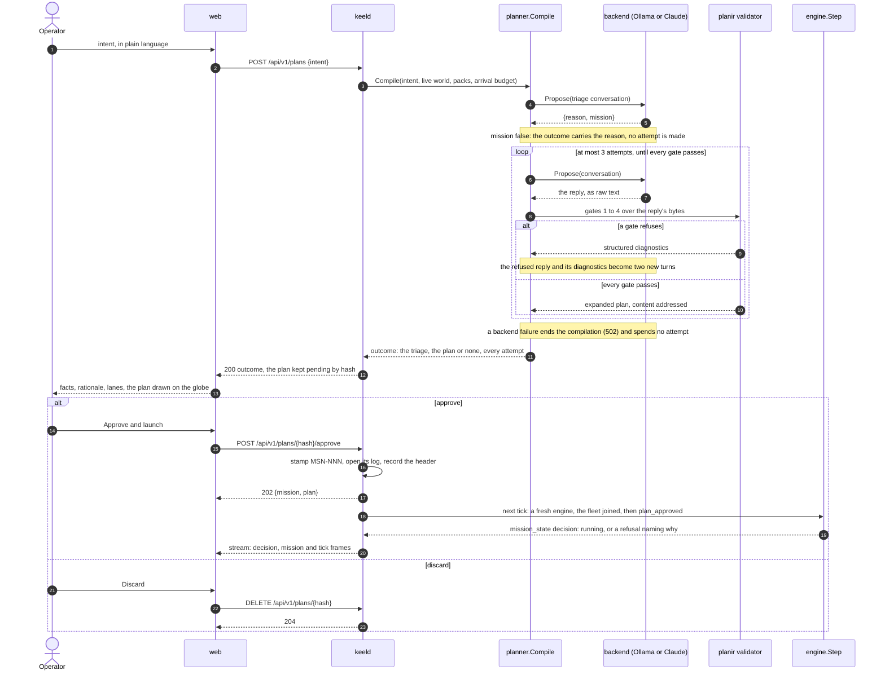

---

## 3. Component boundaries

Boundaries are drawn so that the deterministic core touches nothing that can vary.

| Component | Responsibility | May do I/O | In the decision path |
|---|---|---|---|
| `internal/planner` | Intent to Plan IR | yes (network) | no |
| `internal/planir` | Types, schema, validation | no | no |
| `internal/coverage` | Grid, decomposition, redecomposition | no | **yes** |
| `internal/doctrine` | Parse, version, evaluate, hot swap | no | **yes** |
| `internal/assign` | Capability matching, cost allocation | no | **yes** |
| `internal/engine` | `Step`, tick loop, trace, hash chain | no | **yes** |
| `internal/eventlog` | Append only log, canonical codec | yes (disk) | no |
| `internal/world` | Simulator | no | no |
| `adapters/*` | Transport to vehicles | yes (network) | no |
| `internal/transport` | WebSocket and REST, wire views | yes (network) | no |
| `internal/strictjson` | Closed-schema JSON decoding at every boundary | no | no |
| `internal/httpjson` | Strict request bodies, canonical answers, problem details | yes (network) | no |
| `internal/missionlog` | The record layout of a mission on the chain: one writer for keelsim and keeld, one reader, and the replay that feeds it to `Step` | yes (through the log) | no |
| `internal/pacer` | When a tick runs: fast, or in real time at a pace that may change, and the scaled clock the adapters age links on | no (the wall clock) | no |
| `internal/files` | Reading the world file and the pack directory | yes (disk) | no |
| `internal/daemon` | keeld: configuration, fleet bindings, tick loop, the `Service` | yes (everything) | no |
| `tools/sdkgen` | The TypeScript wire types of `@keel/sdk`, generated from the Go types with coder/guts; a module of its own, so the generator's dependencies never enter keeld's build | yes (disk) | no |

The rule this table encodes: **anything in the decision path is a pure function over in-memory state.** I/O, clocks and concurrency live at the edges. This is what makes the determinism claim checkable by inspection rather than by hope.

The same boundary as an import graph. Solid arrows are Go imports (`internal/domain`, `internal/strictjson`, `internal/httpjson` and `internal/buildinfo`, imported nearly everywhere, are left out); dotted arrows cross a network. Every arrow into the decision path points inward: the only one leaving it is `internal/doctrine` reaching `internal/eventlog` for the canonical hash of a pack, `eventlog.HexOf`, which does no I/O.

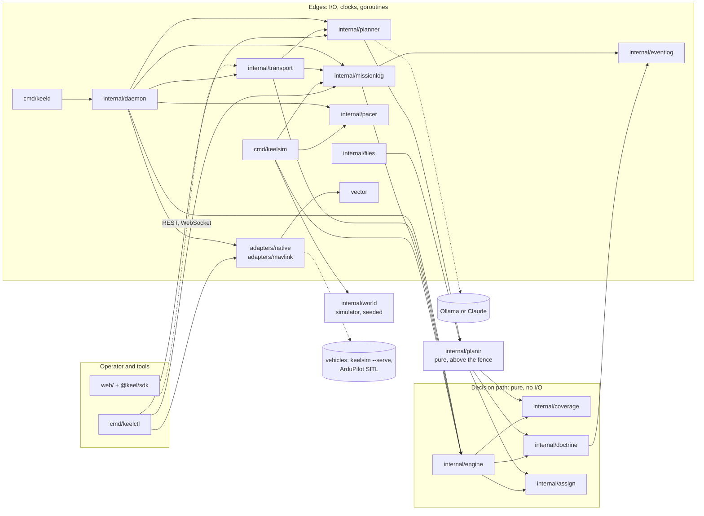

`internal/world` is outside the decision path and deterministic anyway: one seeded PCG stream, vehicles in id order, time counted in ticks. The engine never imports it; the two meet only through events and commands, exactly as the engine and a real adapter will. A scenario and a seed are then a complete bug report for the whole closed loop, not only for the engine, which is what the DST harness needs. `cmd/keelsim` holds the one loop that drives both, with a pacer that decides when a tick runs and nothing else: the wall clock sits in the pacer, so a headless-fast run and a real-time run record the same chain (spec section 15.3).

### 3.1 The engine is a pure function

```go
func Step(s State, in []Event) (State, []Command, []Decision)
```

`Step` does not know that networks exist. It receives the events that arrived, returns the commands to send and the decisions it made, and has no way to observe anything else. The daemon owns the loop:

```
for each tick:
    events  := drain(inbox)          // impure, at the edge
    s, cmds, decs = Step(s, events)  // pure
    log.Append(decs)                 // impure, at the edge
    dispatch(cmds)                   // impure, at the edge
```

Replay reuses `Step` unchanged, substituting the recorded event stream for the live inbox. Replay is therefore not a separate implementation that can drift from the real one. It is the same code fed different input, which is the only way a replay guarantee survives contact with maintenance.

The same holds for what replay writes. `missionlog.Replay` rebuilds the chain through the `AppendHeader` and `AppendTick` the live loops record with, into an appender that keeps only the tick being compared, so a verifying replay compares record by record with one digest each and a mission of any length is never resident. The first record that differs is the report: a forged decision is found at its own record, a pack edited under its version at the refused approval, not at a head hash that differs a thousand records later. `keelctl replay` is a thin command over it, and `keelctl doctrine diff` over `missionlog.Diff`, two engines in lockstep over one `Reader`.

Live, one tick of keeld (`internal/daemon`, `tick`): every impure step sits around the one pure call.

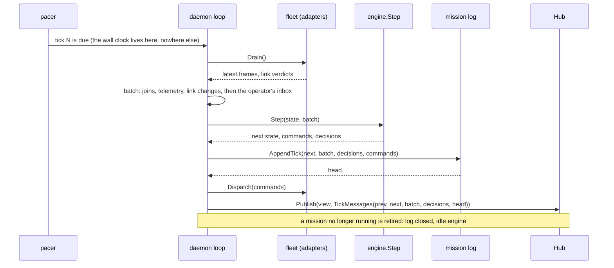

Replayed, the same `Step` fed the recorded batches, into an appender that compares instead of writing:

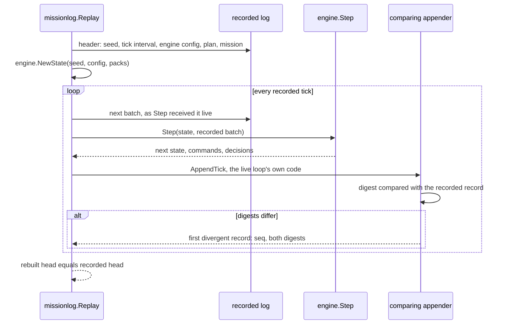

Inside `Step`, one tick is a fixed pipeline, and the order is load bearing:

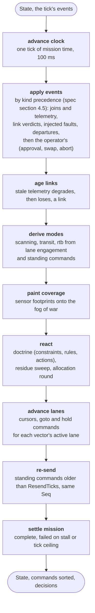

Modes are derived before doctrine reads them, and coverage is painted before allocation so a round sees what its own vectors just explored. Doctrine and allocation share a stage because an action (`redecompose`) runs an allocation round itself, and the per-tick round after it picks up whatever no rule handled.

**Why the engine derives `scanning`.** An autopilot knows it is flying to a point; whether the point is lane work is orchestration knowledge. Asking every adapter to report `scanning` would push that knowledge into each of them, and ArduPilot has no such mode to report. The engine marks a lane engaged once its assignee has reached one of its waypoints from inside the AO, and a moving vector on an engaged lane is scanning. The geofence then applies to lane work and not to the transit from a GCS outside the AO.

**Why commands are re-sent.** The engine sends a `goto` when the target changes. Over a lossy link one lost `goto` would leave the vehicle holding at its previous waypoint, where the cursor never advances, and the mission would stall with no fault to show for it. Re-sending the standing command with its original `Seq` relies on the idempotency the Vector contract already requires (spec section 7.2), so it is harmless when the first copy arrived and the repair when it did not. Telemetry carries the last `Seq` the vehicle applied (`AckSeq`), so only what the vehicle has not acknowledged is repeated. The engine reads it from the latest frame rather than remembering the highest seen: a vehicle that restarts reports 0, and its standing command reaches it again.

### 3.2 The transport is a projection

`internal/transport` is the operator's surface (spec section 8) and holds no mission state. The REST handlers ask a `Service` interface that `internal/daemon` implements; the stream fans out what the daemon publishes into a `Hub` once per tick. The interface sits with its consumer, the Go convention, so the handlers are tested against a fake and the daemon is free to arrange its loop as it likes. A request never touches engine state: an approval, a hot swap or a fault becomes an event of the next tick, answered `202`, and its outcome is a decision like any other.

- **What the stream carries is computed from two states.** `TickMessages(prev, next, events, decisions, head)` derives a tick's frames: the events and decisions as given, then what changed (pack, lane set, coverage), then a `tick` frame with the log head. A view shares its slices with the state it came from, which `Step` never mutates once returned, so projecting every tick costs slice headers.
- **A connection starts from a snapshot, published with the tick.** The `Hub` stores the view after each tick under the same lock it fans the tick's frames out under. A connection therefore joins between two ticks: its first frame is the state after tick N, its next ones are tick N+1's. Asking REST then subscribing, the alternative, loses or doubles whatever happens in between, and every client would reconcile it differently.
- **A slow client loses frames, visibly.** Blocking on a slow browser would stall the tick loop, the one thing that must keep time. Dropping silently would leave the client drawing a state that never existed. The hub drops from a bounded per-connection buffer and still consumes the `seq`, so the gap the client is told to resynchronise on (spec section 8.2) is exactly the loss. Disconnecting the client, the other common policy, costs a reconnect for what a snapshot fixes anyway.
- **The human gate is guarded against the operator's own browser.** Nothing authenticates the API (section 10, item 5), so the realistic attack is not a remote client but a page in another tab posting to `localhost`: a cross-site form aimed at `/approve` would open the gate with nobody looking. `net/http`'s `CrossOriginProtection` refuses state-changing requests from another origin, bodies must be `application/json`, which a foreign page cannot send without a CORS preflight the server never grants, and the stream's handshake checks `Origin` against the same trusted list.
- **One strict decoder.** Request bodies are held to the closed schema of their Go type by `internal/strictjson`, the check the native protocol already applied (section 7.3), moved out of it so the repository has one definition of strict. A misspelled key or a `null` for a required field is a `400` naming it, not a zero value the daemon acts on. What HTTP puts around it (media type, size bound, problem details, the canonical answer) lives in `internal/httpjson`, shared with `keelsim --serve`'s fault endpoint: importing `internal/transport` there would pull the planner and its SDK into the simulator.

A connection's life, the snapshot and the resynchronisation included:

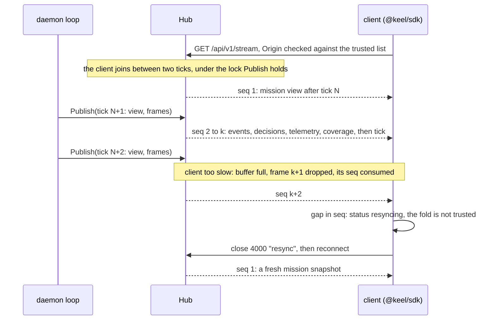

### 3.3 The daemon runs one engine per mission

`internal/daemon` is keeld (spec section 16): the impure half of the loop of section 3.1 over a real fleet. `cmd/keeld` only reads flags and signals and wires it.

- **A mission is the unit of recording.** An approved plan starts a fresh engine recording into the mission's own log, whose first batch joins every vector with its latest frame and approves the plan: the layout `keelsim` writes through the same `internal/missionlog`. A mission replays from its own header, not from the daemon's first tick, its head is its own, and `GET /replays/{id}` serves exactly it. One engine for the daemon's lifetime, the alternative, would make replaying the third mission replay the first two.
- **Between missions the engine is idle and unrecorded.** The operator must see the fleet before any plan exists, and a log of vehicles standing on a pad proves nothing. The idle engine is fed like a mission's, so the view is built the same way; its head is the zero digest of an empty chain.
- **Compilation sees the live fleet.** The prompt and gate 3 read the engine's view of the vectors, not the world file's snapshot: a plan validated against vectors that are not there, or with the battery they had at the last edit of a YAML file, is refused by nothing until it fails in flight. The world file keeps what does not move: areas, stations, and the capabilities a MAVLink vehicle cannot declare.
- **Faults are forwarded, then recorded.** keeld cannot make a vehicle undergo a fault; the simulator serving it can. The `fault_injected` event is queued only on the simulator's `202`, so the engine and the log never claim a fault the vehicle did not undergo, and a vehicle no simulator serves refuses faults rather than having the engine pretend.
- **The pace is the whole loop's, or nobody's.** A mission of the reference world lasts about 38 minutes of real time, too long to watch or to film, so keeld runs a simulated fleet up to 20 times faster (spec section 16.5). Speeding up keeld alone would be wrong twice: a world behind the engine flies its vehicles slower than their cruise speed in mission time and their frames read as silence, and a view sped up in the browser alone cannot get ahead of the present. So keeld's pacer, keelsim's clock endpoint and each SITL's `SIM_SPEEDUP` change together, the simulators first when the pace rises and last when it falls, the engine never ahead of the world; a failure brings every one back. A fleet holding one real vehicle keeps real time: nothing flies a real vehicle faster. The pace decides when a tick runs, never what it holds, so it is not recorded; what else read the wall clock on the loop, the adapters' link health, reads the pacer's scaled clock instead, so a threshold is the same stretch of mission time at any pace.
- **Shutdown goes through the engine.** A running mission's last tick is an `operator_abort`, so the stop commands are decisions like any other: recorded, hashed, replayable. Dispatching stops from the daemon directly would move vehicles on commands the log never saw.
- **What is shared lives once.** The pack and world loaders (`internal/files`), the pacer (`internal/pacer`) and the mission layout (`internal/missionlog`) moved out of `keelsim` and `keelctl` when keeld became their third user: three copies of a loader drift, and two writers of the mission layout would be a replay that verifies one program's logs and not the other's.

A fault from the browser, under the reference pack (`recon-standard@2.1.0`): the simulator undergoes it, the engine sees only its record and its consequences, and doctrine reacts.

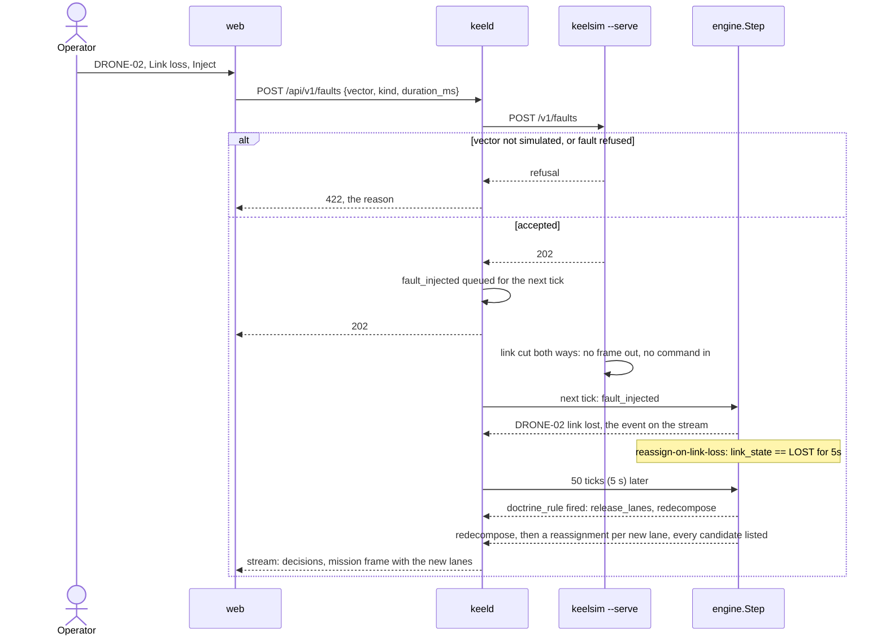

### 3.4 Lifecycles

A mission lives in the engine keeld creates for it at approval (section 3.3). `awaiting_approval` is the state gate 4 projects while the plan waits at the human gate; the engine never holds it.

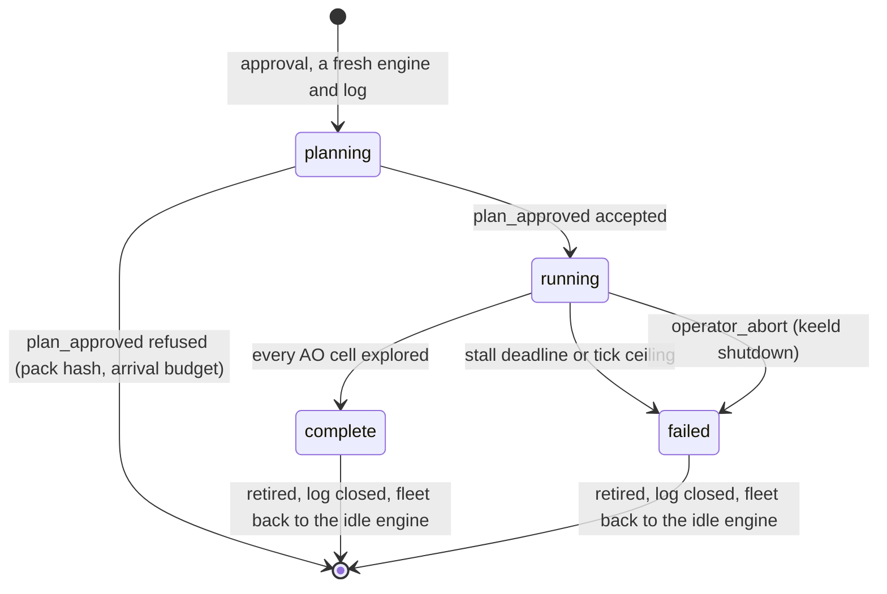

A vector's link is aged by the engine from mission time, and overridden by what the transport and the operator say (spec section 4.5). A vector in mode `down` is not aged and does not come back on a frame: only a new `vector_joined` readmits it.

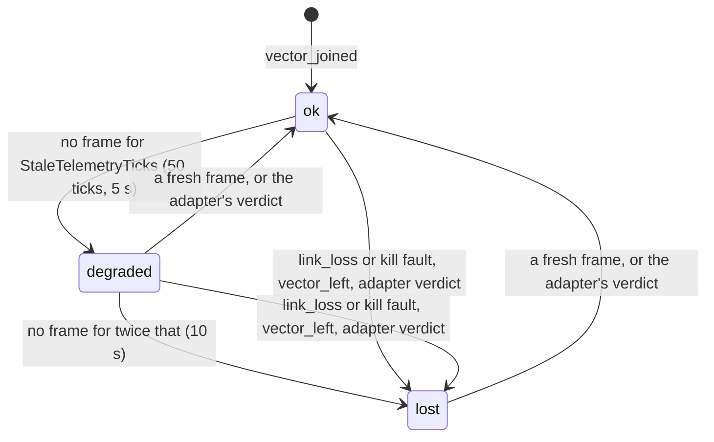

---

## 4. Determinism: mechanism and proof

This section is the reasoning. `docs/determinism.md` is the guide to checking it: where each rule is enforced, the tests that hold it, and the commands that reproduce a run, replay the reference recording and break its chain.

### 4.1 The five sources of non-determinism in Go, and how each is closed

| Source | Closure |
|---|---|
| Wall clock | Logical clock only. Mission time is an `int64` advanced by exactly one tick interval. `time.Now()` is banned in the decision path and the ban is enforced by a lint rule |
| Map iteration order | Go randomizes it deliberately. Keys are collected and sorted before every iteration. `internal/engine/order.go` provides the helpers so the pattern is uniform |
| Goroutine scheduling | `Step` starts no goroutines and reads no channels. Concurrency exists, but never inside a decision |
| Random number generation | A seeded `math/rand/v2` source is carried in `State`. The global source is banned by lint |
| Floating point accumulation | Addition is not associative in floating point, so any reduction over a collection sorts first. Costs are compared with an explicit epsilon, and ties break on `VectorID` |

The fifth is the one that bites in practice: summing lane costs in map order gives a different total on different runs, by an amount too small to notice and large enough to flip a comparison. Sorting before reduction is not fastidiousness, it is the difference between a system that replays and one that almost replays.

The wall clock is closed out of the decision path, not out of the loop: `internal/pacer` holds it, and decides when a tick runs. Its pace may change while the loop runs, 1 to 20 times real time for a simulated fleet (section 3.3, spec section 16.5), which changes when ticks run and nothing they hold, so the pace is not recorded and a replay ignores it. The pacer also gives the adapters a scaled clock, wall time multiplied by the pace, so the one other wall-clock reading on the live path, an adapter's link aging, means the same mission time at any pace.

### 4.2 The hash chain

Each record carries `PrevHash` and `Hash = SHA256(canonical(...))`. This yields three properties:

- **Tamper evidence.** Altering any record invalidates every subsequent hash.
- **A single-value equality check.** Comparing two runs is comparing two head hashes, not diffing two logs.
- **A visible artifact.** The head hash is rendered live in the UI. During a replay it is recomputed and compared. A viewer sees an abstract property become a string that matches, which is worth more than a paragraph claiming the property holds.

Canonical encoding (spec section 9) is what the chain rests on. Sorted keys, `'g'` format with 17 significant digits for exact float round-trip, omitted optionals rather than nulls. A single sloppy encoder anywhere makes the whole chain meaningless, which is why there is exactly one and everything routes through it.

### 4.3 Deterministic simulation testing

Determinism is only valuable if it is exercised against adversity. The test harness (`internal/engine/dst_test.go`) is modelled on the FoundationDB and TigerBeetle approach:

```
for seed in 0..N:
    world  := NewWorld(seed)
    faults := NewFaultSchedule(seed)   // world: kill, link loss, battery drain,
                                       //   GPS drift, stale telemetry
                                       // wire: drop, duplicate, delay, reorder
    run(world, faults, asserting I1..I9 at every tick boundary)
```

Because the simulator is seeded and the engine is pure, a failing seed is a complete bug report. The harness prints the reproduction command on failure, and the failure reproduces exactly, every time, forever. That is the property that makes concurrency and failure-handling bugs tractable instead of folkloric.

It flies the reference mission through the loop keelsim runs, `internal/world` included, rather than a toy of its own: a scenario and a seed then report a bug in the whole closed loop, the radio model's loss and jitter underneath the harness's own wire faults. Each seed ends with a verifying replay of its log, so every run also exercises I6 and I7 on a mission shaped by faults, where a map iteration or an unsorted reduction would show.

Two invariants are asserted in the only form a fault leaves true. An injected battery collapse breaks the envelope by construction, so I4 asserts the reaction: a vector outside its envelope stands on `rtb` at the tick boundary. That holds only under a pack reacting to each constraint, so the harness swaps only to such packs and refuses to start if the plan's is not one. I3 asks the allocator the engine's own question, through `State.PendingLanes` and `State.AllocationRequest`, instead of re-deriving eligibility: an oracle with its own notion of who can take a lane would flag every lane the range check rightly refuses. Work nobody can take is bounded by the stall instead (spec section 5.7).

The invariants (spec section 11) are chosen so that violations are *interesting*. I1 (no double assignment) and I3 (eventual assignment) together forbid both the obvious race and the subtle livelock where redecomposition keeps reshuffling without converging.

---

## 5. The tactic and geometry split

The natural implementation is to have the model emit waypoints. It is also wrong, for four reasons:

1. **Hallucinated coordinates are undetectable.** A wrong lane count is obvious. A waypoint 200 m outside the AO looks exactly like a correct one.
2. **Geometry is the part computers are good at.** Boustrophedon decomposition is a solved problem with an exact answer. Asking a language model to approximate it is strictly worse.
3. **It destroys replay.** If waypoints come from the model, regenerating a plan requires the model, and the model is not reproducible.
4. **It makes plans huge.** Thirteen waypoints times four lanes is 52 coordinate pairs the model must emit without error. The tactic is four scalars.

So the model emits four scalars and a rationale, and `coverage.Decompose` emits the 52 coordinates. Their UI's *"Voir le code source (188 lignes)"* is, in KEEL, the expanded plan: generated deterministically, rendered for inspection, and hashed.

This split has a second benefit that matters more over time. Improving the geometry (better overlap handling, terrain-aware lanes, turn-cost minimisation) is a change to tested, deterministic Go. It requires no prompt engineering and no re-evaluation of the model. The two halves evolve independently, which is the usual reason to draw a boundary in the first place.

---

## 6. Doctrine as the shared vocabulary

Doctrine is deliberately used at both ends of the pipeline:

- **Before launch** its constraints validate the compiled plan.
- **During execution** its rules drive reaction.

One artifact, two consumers. A battery reserve rule is not written once for the planner and again for the runtime, which is exactly the duplication that lets the two disagree and produces a plan that validates and then immediately violates its own constraints.

### 6.1 Why the expression language is not Turing complete

The grammar (spec section 6.2) has no loops, no user functions, and arithmetic limited to `+` and `-`. This is a deliberate ceiling. A doctrine pack is authored by an operator, not a programmer, and it is evaluated inside the decision path where it must terminate in bounded time. A rule language that can loop is a rule language that can hang the orchestrator. Every reactive rule this domain needs fits comfortably under the ceiling.

### 6.2 Shadowing is reported, never silent

When several rules fire, the highest priority wins and every shadowed rule is recorded with the id that shadowed it. This is a debuggability decision. The question an operator actually asks is not "what did it do" but "why didn't it do the other thing", and a system that discards the rules that nearly fired cannot answer it.

### 6.3 Hot swap semantics

The requirement comes from their own claim: *"A new fact, a rule changes. The update applies without breaking the rest."* Read strictly, that is a statement about **state preservation**, and the hard part is the duration windows.

A rule `when: link_state == LOST for 5s` carries per-agent state: when the condition first became true. Discard it on swap and a link that has been down for four seconds restarts its clock, so the reaction is delayed by the swap. The mission would not break visibly, and the behaviour would still be wrong.

KEEL keys window state by `(rule id, agent)` and retains it when a rule of the same id exists in the new pack. Swapping a pack that changes a rule's *action* but not its *condition* therefore fires at exactly the moment it would have fired without the swap. Retention keys on the id alone, not the condition, which has a cost (section 10).

The swap is an event like any other, applied in the tick's event stage, so the same tick's doctrine already runs under the new pack:

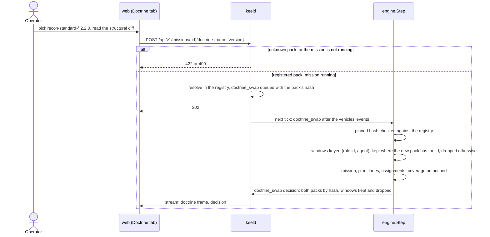

`keelctl doctrine diff` exists to make this checkable: it replays a recorded mission under two pack versions and reports which decisions diverge (spec section 10.4). That turns a marketing sentence into a regression test: exit 0 when a pack revision changes no decision on a reference recording, 2 when it does. Two choices keep the answer about doctrine. Only the pack the plan starts under is substituted, so a recorded swap still happens in both replays and puts window retention itself under test. And decisions are compared modulo the starting pack's name, read through the one label the engine names a pack with (`engine.PackLabel`), in the two places it does: otherwise every pair of packs would differ at the approval that names them. The comparison is open loop (section 10).

---

## 7. Integration layer

Their claim is *"an open architecture to integrate manufacturers, without vendor lock-in, via interfaces and integrations"*. Two adapters over genuinely different transports are what makes that claim demonstrated rather than asserted:

| Adapter | Transport | Purpose |
|---|---|---|
| `adapters/mavlink` | MAVLink v2 binary over UDP to a live ArduPilot SITL | A real industry protocol against a real autopilot |
| `adapters/native` | JSON over WebSocket to `keelsim` | The simple case, and the reference for third parties |

`docs/integration.md` is the integrator's guide: the three paths to a vehicle, what it must do, and how to pass the suite.

MAVLink is the point. Anyone can define a REST API and call it an integration story. Speaking the actual binary protocol that ArduPilot and PX4 speak, to an autopilot that really arms and really flies a guided waypoint, is the part that demonstrates the problem is understood.

### 7.1 The conformance suite is the real artifact

`keelctl vector validate` runs nine cases (spec section 13). An API tells an integrator what to call; a conformance suite tells them whether they got it right, and tells the platform whether to trust them.

C8, capability honesty, is the case that matters most. An adapter that accepts commands it cannot execute is worse than one that refuses them: the orchestrator keeps assigning work that silently never happens, and the failure surfaces as a mission that mysteriously fails to converge. Refusal is recoverable, because `redecompose` reassigns. Silence is not.

- **The suite brings its own faults.** C6 needs a vehicle that stops talking and C7 a link that drops, and a suite that asks the vehicle to cooperate can only test the vehicles written to cooperate. A proxy between the adapter and the vehicle, the pattern of fault injectors such as Toxiproxy, withholds and cuts at the transport, so the same run validates `keelsim`, an ArduPilot SITL and hardware. It does not replace an adapter's own tests: the proxy sees bytes, not the contract.
- **Withholding pauses a stream, never drops from it.** Dropping bytes from a WebSocket would corrupt its framing and test the adapter's parser, not its timeout. Datagrams are whole messages, so over UDP dropping is the faithful fault.
- **A skipped case is not a pass.** Motion is the one thing a validation must not do unasked, since against hardware C3 is a takeoff. Without consent the suite skips C3 to C5 and the verdict stays "not conformant", naming the flag: reporting conformance for a vehicle that was never commanded would be the silent acceptance C8 exists to refuse, one level up.
- **The fake ArduPilot is a package, not a test file.** `adapters/mavlink/mavlinktest` serves the adapter's tests and the suite's alike, as `net/http/httptest` does, and gives an integrator building on the MAVLink adapter the same fixture.

### 7.2 The contract's mechanics live once, in `vector.Agent`

Every adapter needs the same machinery: a telemetry channel it owns, a `Seq` filter, a cached health view, refusal of what it cannot do. Written once per adapter, it is written differently each time, and the conformance suite then tests nine re-derivations of one contract. `vector.Agent` implements it once; an adapter is a transport plus an `Agent`, feeding it `Publish` for every frame, its `AckSeq` filled, and `Disconnected` when the link drops.

- **Types are aliases of `internal/domain`**, not copies. The frame an adapter publishes is the frame the engine consumes, with no translation layer to drift. The cost: every change to the domain vector vocabulary is a change to the public API.
- **The telemetry channel lives until `Close`.** Closing it on disconnect, as the first draft of spec section 7.1 said, contradicts reconnection (C7): a closed channel does not reopen, and a consumer re-subscribing to a fresh one races the frames published in between. One channel per adapter lifetime means one reader per vector, and a disconnect is what `Health` is for.
- **The `Seq` filter is on the acknowledged `Seq`, not the sent one.** The adapter sits on the orchestrator's side of the link. Dropping every `Seq` it already transmitted would swallow the engine's re-send (section 3.1), which exists because the first copy may have been lost beyond the adapter.
- **The acknowledgement comes from the frame, and only from it.** `Publish` takes each frame's `AckSeq` as the vehicle states it, lower included. A separate `Ack` call that only moved forward would outlive a vehicle restart: the vehicle reports 0, the engine re-sends its standing command, and the adapter would drop it as acknowledged. One field read the same way by the adapter and the engine cannot disagree with itself.
- **Telemetry is latest wins.** A frame is state, superseded by the next. Blocking the adapter on a slow consumer would stall its transport reader and freeze its own health view; dropping the newest would deliver stale state first. Dropped frames are counted in `Health`.
- **C2 is enforced at `Publish`.** A frame with another vector's id, a non-physical mode or mission time going backwards is refused with an error naming it, so a translation bug surfaces in the adapter that has it rather than as a doctrine reaction in the engine.
- **C8 is a declared set of command types.** Capabilities (spec section 4.1) describe what a vehicle carries, not what its autopilot accepts. Each adapter declares the command types it executes, and the `Agent` refuses the rest with `ErrUnsupported`.

### 7.3 The native protocol

The native adapter is the reference a third party reads before writing its own, so its protocol (spec section 7.3) makes each of the contract's obligations visible on the wire rather than implied.

- **The adapter dials.** C7 says the adapter re-establishes the link, and only the end that dials can. One connection per vector keeps the `Vector` interface one-to-one with a socket: no multiplexing, no routing of frames by id inside a shared stream.
- **The vehicle declares itself in its hello, command types included.** Capabilities configured on the orchestrator's side would describe the vehicle someone expected, not the one that answered. `supports` has no default: an implicit "everything" is the silent acceptance C8 exists to refuse, and a vehicle that cannot abort says so and has `abort` refused rather than ignored.
- **Decoding is strict, and the schema is the Go type.** The closed schema of Plan IR (spec section 5.1) applies here for the same reason: a field silently dropped or silently defaulted is drift that surfaces far from its cause. A missing longitude decoded by `encoding/json` alone lands on the prime meridian, and a key in the wrong case matches anyway. The required and known fields are read off the domain types' JSON tags rather than kept in a second list beside them, which would drift by construction. The check lives in `internal/strictjson`, shared with the REST bodies (section 3.2).
- **A violation closes the link, and `Health` carries the reason.** No package logs, so `Health` is the adapter's only observable surface. Dropping a bad frame and keeping the link would leave a vehicle sending nothing but bad frames looking merely silent, aging to lost with no reason given. Closing names the fault to both ends; the redial that follows costs little, and a vehicle that keeps failing keeps saying why.
- **Commands and frames are latest wins, both ways.** `Execute` and the vehicle's `Send` must not block on the network (spec section 7.1), and neither needs a queue: a newer `Seq` supersedes an older command, a newer frame an older state. A single slot drained by a writer gives both properties at once, and keeping the slot across a disconnect delivers the standing command as soon as the link returns, without waiting for the engine's re-send.
- **The newest connection wins.** The case that actually occurs is an adapter redialling while the vehicle still holds the half-open connection it lost; refusing the newcomer would lock it out until the vehicle's own read fails. The case this gives up, two orchestrators on one vehicle, is outside the design (section 10, item 6), and they would visibly evict each other rather than silently share.
- **`github.com/coder/websocket`** (formerly `nhooyr.io/websocket`). Every operation takes a context, which is what bounds a handshake, a write and an idle read, and what `Close` cancels to stop the goroutines C9 counts; writes are safe from concurrent goroutines; it has no dependency beyond the standard library. `gorilla/websocket` allows one concurrent writer and has no context support, and `golang.org/x/net/websocket` points its own users to alternatives. The frontend stream (`internal/transport`) is to use the same library, so the repository carries one.

### 7.4 The MAVLink adapter

The native protocol was designed to carry the contract; MAVLink was not, and the adapter (spec section 7.4) is where the gap is closed. Every decision was checked against ArduPilot's own command handlers rather than against the MAVLink documentation alone, since what an autopilot accepts is what it implements.

- **A shared link, one adapter per system id.** The native adapter has one socket per vector; MAVLink does not work that way. A telemetry radio or a router such as MAVProxy carries several vehicles on one port, told apart by system id, and a ground station listens on 14550 for all of them. One node per endpoint routing by system id is that topology; one node per vehicle would work against a lone SITL and fail against the first radio. The `Vector` interface stays one-to-one with a vehicle, which is what the engine needs.
- **`AckSeq` is the autopilot's `COMMAND_ACK`.** MAVLink has no `Seq`, so the adapter is the vehicle's voice for it (spec section 7.1). `MAV_RESULT_ACCEPTED` is the autopilot saying it applied the command, the nearest equivalent to a native vehicle reporting `AckSeq`. Telemetry reflection (the target echoed back) was the alternative, and it is exactly what design section 10, item 11 names as the durable fix for a different gap: acknowledgement is per command, not per effect.
- **The adapter never retries.** A refused or unanswered command is abandoned, unacknowledged, and the engine re-sends it every `ResendTicks` because it is unacknowledged (spec section 7.2). Two retry loops, one in the adapter and one in the engine, would disagree about when to give up; one loop, already in the log, is enough.
- **One command in flight per vehicle.** A `COMMAND_ACK` names the command, not the request: two `DO_REPOSITION` in flight would take each other's answer. The adapter waits for an answer, or its timeout, before sending the next command, a newer `Seq` included.
- **`DO_REPOSITION`, not `SET_POSITION_TARGET_GLOBAL_INT`.** Both fly to a point in GUIDED; only the first is acknowledged, and it switches to GUIDED itself with `MAV_DO_REPOSITION_FLAGS_CHANGE_MODE`. ArduCopter and ArduRover both handle it on `COMMAND_INT`. `COMMAND_INT` is used for every command: ArduPilot converts `COMMAND_LONG` internally and compiles it only under `AP_MAVLINK_COMMAND_LONG_ENABLED`.
- **`hold` stays in GUIDED.** A reposition to where the vehicle is stops it the same way on a copter and a rover, and the next `goto` needs no mode change. LOITER or HOLD would be the autopilot's own hold, at the cost of two mode tables and a mode change on every resume.
- **Frames are withheld rather than guessed.** A heartbeat from another autopilot, a vehicle type contradicting the declared domain, an unknown battery, no absolute position estimate: each would make the frame a lie doctrine reacts to (a battery reserve rule firing on an invented 100 percent). No frame, the reason in `Health`, and no command either: moving a vehicle KEEL cannot see is worse than leaving the command waiting.
- **The position is the autopilot's only when it says it has one.** ArduPilot sends `GLOBAL_POSITION_INT` whatever its AHRS answers (`GCS_MAVLINK::send_global_position_int`: *we send stale data*), at (0, 0) before its first estimate. Published, that frame joined DRONE-01 at (0, 0) under the Docker stack, and a `hold` would have repositioned the vehicle there. `EKF_STATUS_REPORT` under ArduCopter's own navigation rule (`Copter::ekf_has_absolute_position`) says whether the position is real; a GPS fix (`GPS_RAW_INT`) is not the position the AHRS sends, and (0, 0) is no sentinel MAVLink defines. The two streams are independent, so the first frame after an estimate is lost is taken on the previous report: ArduPilot then sends its last known position, at most one report old.
- **The physical mode is derived from the command, as in keelsim.** The engine derives `scanning` from the mode (section 3.1), so a vehicle keeping station at its waypoint must read `transit` whichever adapter it is behind. The autopilot's mode overrides where it knows better: a failsafe RTL or LAND reads `rtb`, a pilot taking over in LOITER reads `idle`.
- **`github.com/bluenviron/gomavlib/v4`.** The maintained pure-Go MAVLink implementation (it powers the `mavp2p` router): v2 framing and signing, generated dialects including `ardupilotmega`, UDP, TCP and serial endpoints behind one node. The alternative, generating a codec from the XML definitions, would be the same work less tested.

One `goto` to an airborne ArduCopter, and the one retry loop, the engine's:

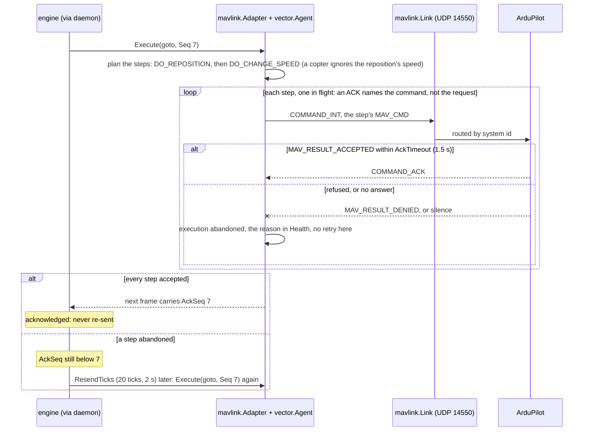

---

## 8. Frontend

React 19, TypeScript, Vite, CesiumJS, Tailwind 4, shadcn, TanStack Router and Query.

### 8.1 Why Cesium rather than a 2D map

The scenario is aerial vehicles at altitude over terrain, with sensor footprints projected onto ground that is not flat. A 2D map has to lie about all three. Cesium is also the reference stack in a private portal, so the Cesium integration is a solved problem being reused rather than a risk being taken (section 9.2).

### 8.2 Rendering model

Vehicles are Cesium entities backed by `SampledPositionProperty`, fed from telemetry. Cesium interpolates between samples, which decouples render smoothness from telemetry rate and means a 1 Hz feed still looks like flight. Fog of war is a separate ground-clamped primitive updated per coverage frame, not per telemetry frame, because it changes far less often. It is one rectangle over the AO raster, textured with the raster itself (a block of pixels per cell, veiled until explored), since the grid's equirectangular cells map onto a latitude and longitude rectangle exactly: one texture whatever the cell count, where one geometry instance per cell would be thousands of shadow volumes. Cesium uploads a canvas texture again only when handed a different canvas, so two take turns.

The stream is folded into one mission view by `applyFrame` in `@keel/sdk`, so a third-party UI folds it the same way, and `web/` holds the result in a small store that publishes at tick boundaries only: a reader never sees positions of one tick beside cursors of the last. The globe reads the store imperatively, so ten ticks a second redraw the scene without rendering a React component; the panels read it through `useSyncExternalStore`.

A sample is stamped with the vector's `last_seen_ms`, and the live clock runs 500 ms (five ticks) behind the latest tick, steered in rate rather than set, so every vector sits between two samples it has. This is entity interpolation as networked games draw remote players (Valve's Source networking model): without the delay the clock would always ask for a position past the last sample, and a vector would hold still, then jump. The globe shows the mission half a second late; the head hash the operator reads is the latest tick's.

The globe draws the orchestrator's view and nothing else. A blackout zone is simulator physics the engine never sees, so the operator sees a link degraded or lost (the line from a vector to its nearest station), not the zone that caused it. KEEL models no detection.

The replay scrubber drives the same Cesium clock the live view uses. Live and replay are the same rendering path in different clock modes, mirroring the engine, where live and replay are the same `Step` fed different input.

A log holds events, decisions, commands and tick counts, not the fog nor the lanes a redecomposition cut, so a replay is drawn from `Step` run over it, and keeld runs it: `GET /api/v1/replays/{id}/frames` replays the finished log, verifying it, and serves a window as stream frames projected by the live `TickMessages`, which the page folds with the live `applyFrame`. The window follows the playhead (`playbackWindow.ts`); its telemetry is thinned to 1 Hz and preloaded into the vectors' sampled positions, so the globe interpolates whichever way the clock runs. Alongside, a worker recomputes the log's chain from its bytes (the five-field preimage, pinned against the Go encoder by a golden file) and collects the recorded decisions, the replay's trace. The verification panel sets the two sides that do not trust each other against each other: at the playhead, the head keeld rebuilt beside the head the page computed for the same tick; at the end, the page's head, keeld's recorded head and keeld's rebuilt head.

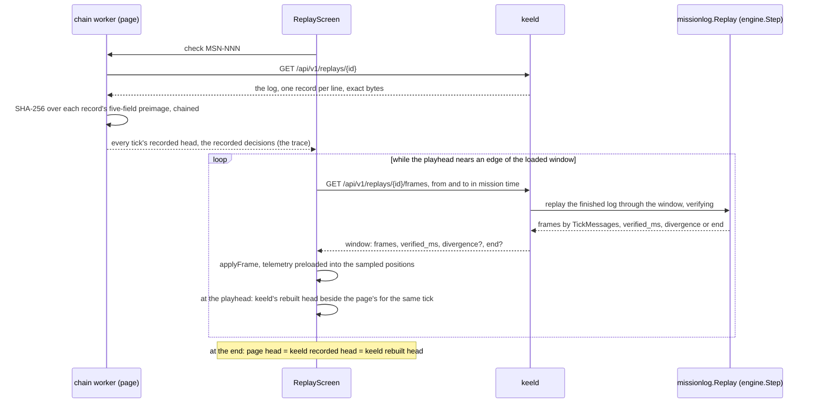

### 8.3 Visual language

Taken from LE_VECTOR's own interface: near-black background, monospace throughout, 3D tilted perspective, cyan trajectories, magenta diamond air tracks, dashed magenta AO boundary, translucent scan quad, MGRS beside lat/lon. The intent bar, the rationale panel and the launch gate follow the same flow their assistant panel does: a column docked right of the globe, never over it, intent typed at its bottom, the compiled plan read above it (facts, the model's rationale, lanes with their step counts and projected vectors, the Plan IR and the expanded plan as source), approve or discard between the two. A compilation the validator refused shows every diagnostic and nothing to approve. The plan awaiting the gate is drawn on the globe, dashed cyan, the camera brought over its AO: the operator approves geometry they have seen, not a description of it.

The screen splits what the operator watches from what they act with, as a C2 console does. The column left of the globe holds only what they watch: the vector roster above the decision trace, two sections of their own (each with its icon and count on a band, every decision marked by a bar in its kind's colour, so a list of vehicles and a log of events never read as one list) around a separator dragged or moved with the arrow keys, the split remembered in the browser (shadcn's Resizable). The roster lists the fleet keeld is bound to, not only the vectors that joined: an ArduPilot autopilot publishes nothing until its EKF has an absolute position (section 7.4), about 40 s after it boots, and a vehicle missing from the screen for that long without a word reads as a fault. A vector not joined yet holds its place in the id order as *waiting*, with its adapter's reason (`GET /api/v1/fleet`, read every second until the whole fleet has joined, never on the stream since it is not engine state), and selects nothing, there being no position to fly to; the globe draws a vector only once its position is trusted. The trace is what the page saw on the stream, not the mission's record: a connection starts from a snapshot without past decisions and a resync skips the frames it lost, so both points are marked in it rather than papered over; the log, read by the replay scrubber once the mission is finished, is the complete trace. A decision opens onto everything it recorded (the rule fired and the rules it shadowed, every candidate with its rejection reason), because "why didn't it do the other thing" is answered by what lost. Selecting a vector in either list flies the globe to it and keeps the trace to the decisions naming it.

The right column holds what the operator acts with, as three tabs: the assistant, the doctrine panel, and the fault injection (*Faults*), a hot swap or a fault happening while a mission runs and the assistant then having nothing pending; the active pack's reference and hash stay in the column's header. A fault is always about one vector, picked in the tab among the fleet or in the roster: the screen holds one selection, and selecting a vector never switches tab. Above the intent bar the assistant lists the names an intent may use, the world's areas with their surface and its stations (`GET /api/v1/world`), since the planner resolves no other and an operator should not have to know them beforehand; a name picked lands at the intent's caret, an area picked brings the camera over it. The globe outlines every area, thin and pale with its name, and the stations, before any mission and framed once when no mission AO is on screen; the running mission's AO and stations are then the mission scene's own. Its diff is structural, by id, because the engine matches by id: a rule the new pack keeps keeps its duration windows, changed or not, and a removed rule loses them (section 6.3). A line diff would show a reordered rule as a change the engine does not see.

A strip under the globe carries mission time and the log head. Live is the present: keeld cannot be paused, and the fog, lanes and roster always show the present, so the live strip shows the stream's state and nothing to pause or rewind; rewinding the trajectories alone would put two instants on one screen. What it can change is the pace of a simulated fleet (section 3.3): a ladder whose first rung is *Real time*, then ×2, ×5, ×10 and ×20, pressed on the pace the stream reports rather than on the last click, so every page shows the pace keeld runs at whoever set it. Above real time the strip turns amber and its state reads *Accelerated ×N* where it read *live*, because an operator who takes a sped-up fleet for real time misjudges every delay on screen; the state rather than a badge beside the ladder, the strip having no width to spare at 1080p. keeld's reason stands on the ladder when the fleet holds a real vehicle, and its refusal beside it when a simulator does not follow. The globe's clock follows the pace: its delay, horizon and jump scale with it (`liveFollow.ts`), since the stream then sends one telemetry frame in `speed` ticks. Play, pause, the direction and the replay's own speed ladder belong to a replay, where every layer comes from the same instant of the log. Text is in English per the project's artifact language rule, while their own UI is French.

The palette lives on shadcn's token names in `web/src/index.css`, so a component `shadcn add` brings takes it unedited, and the globe's colours in one table the panels read too (`web/src/cesium/missionLayers.ts`). MGRS is a display format only (spec section 3): the time strip shows the ground position under the cursor, picked on the ellipsoid the globe draws, in MGRS beside lat/lon, and the selected vector's roster row its own, through `mgrs` (proj4js) rather than a geodesy routine kept here. A mission's AO appearing, or a plan awaiting the gate, brings the camera over it tilted 40 degrees, once, after which the camera is the operator's.

---

## 9. Technology choices

### 9.1 Go for the core

Concurrent event-driven work with a hard requirement that the concurrency stay out of the decision path. Go makes both halves natural: goroutines and channels at the edges, plain functions in the middle. It compiles to a single binary with no runtime dependency, which matters for a deployment story in a disconnected environment. `math/rand/v2` gives explicitly seeded sources without global state.

The deliberate counterpoint: Go alone does not signal low-level work. That signal comes from the MAVLink binary codec and the determinism discipline, which is where it should come from.

### 9.2 Reusing existing portal

The Cesium integration is lifted from an existing production frontend. Two pieces are copied nearly verbatim because both encode a trap that costs hours to rediscover:

- **`viteStaticCopy` with `stripBase: CESIUM_SOURCE_DEPTH`.** Since `vite-plugin-static-copy` v4, `dest` joins with the matched file's full relative directory. Without the stripped base, Cesium's workers and assets land under `dist/cesium/node_modules/cesium/Build/Cesium/...`, every one of them 404s, and Cesium fails with "An error occurred while rendering", a message naming neither the file nor the URL.
- **`useFontReady` before building label entities.** Cesium bakes label text into a WebGL texture atlas. An atlas built before the font face has loaded keeps the fallback font permanently, and no later re-render fixes it.

`playbackWindow.ts` is adapted rather than copied: its window-as-cache model, speed ladder and direction/magnitude split apply directly to mission replay. Dropped: the inertial camera and ICRF preloading (orbital concerns), Keycloak, `satellite.js`, i18n and Storybook.

### 9.3 No database

The append-only event log is the source of truth. A relational database would be a projection of it, and a demo does not need the projection. Adding PostgreSQL, Redis and a message bus to a three-week project buys operational surface area, not capability.

This is also the more defensible architecture on the merits. Event-sourced state with deterministic replay means the log *is* the system of record, and any query model is derived and rebuildable. A SQLite projection is planned if query needs justify it, and it changes nothing about correctness.

### 9.4 Offline cartography, no Cesium ion

The globe fetches nothing from another origin: no tile server, no Cesium ion, no token. Two reasons. A public repository that renders a blank globe until the reader signs up for a third-party account loses most of its readers in the first thirty seconds. And an orchestration layer for this domain has to run where there is no internet, the argument that already makes the local planner the default (section 2.1).

- **Imagery: NaturalEarthII**, bundled with Cesium and copied under `/cesium` with its other assets (`web/src/cesium/imagery.ts`). Coarse, about 10 km a pixel, and dimmed: context when zoomed out, not a map at mission scale.
- **Map at mission scale: an OpenStreetMap vector extract** of the reference area (roads, tracks, rail, waterways, water; `web/public/basemap/reference.geojson`, 1.4 MB), drawn as ground-clamped lines in the tactical style (`web/src/cesium/basemap.ts`). Vector, not raster: the OSM tile usage policy forbids bulk download and offline use of `tile.openstreetmap.org`, while the ODbL allows extracting the data, redistributing it and using it offline, provided it is attributed and stays under the ODbL. The file carries both terms, and the globe keeps Cesium's credit display, where "© OpenStreetMap contributors" shows. `web/scripts/basemap.mjs` reproduces the extract from one Overpass query, deterministically, so a refresh is a readable diff. Buildings are left out: some 30,000 in the area, 9.5 MB and 35,000 entities for a context the road network already gives.
- **Terrain: the WGS84 ellipsoid**, what the world file and the engine measure altitudes against (spec section 3). The Bievre plain is flat to a few tens of metres.

`Ion.defaultAccessToken` is cleared, so anything reaching for ion by accident (a geocoder, an asset id) fails loudly instead of going online on the demo token Cesium ships. The cost is the basemap's reach, recorded in section 10.

---

## 10. Known limitations

Stated because a design document that lists no weaknesses is not describing a real system.

1. **The simulator is not a flight dynamics model.** Kinematics are simplified: no wind, no attitude dynamics, no acceleration, no aerodynamic constraints beyond speed and climb-rate caps. The battery pays for distance on the allocator's own model, so the simulator cannot surprise the allocator the way a real battery in a headwind would. GPS error is uniform per axis rather than Gaussian, to keep transcendental functions out of the draw. Radio is line of sight to the nearest station, judged when a message is sent; the relay's `radio_mesh` capability extends nothing yet. Adequate for orchestration logic, inadequate for anything about vehicle control. The MAVLink adapter partly compensates, since ArduPilot SITL is a real autopilot with real dynamics.

2. **Determinism holds within a Go version and a platform.** Go's floating point is IEEE-754 and its map ordering randomization is closed out by sorting, but this has not been verified across architectures. The known cross-architecture hazard is fused multiply-add: the Go specification allows `a*b + c` to compile to one FMA instruction, several backends (arm64 among them) do so, and amd64 does not. Decision-path code closes it by rounding every such product explicitly with `float64(...)`, which the specification guarantees prevents fusion (spec section 12, requirement 7). The transcendental functions of package `math` are compiled under the same rules and are not covered. Golden fixtures are generated on amd64; until a cross-architecture run exists (arm64 hardware, or `GOARCH=arm64` under qemu), the claim is scoped to what is tested.

3. **The doctrine expression language is small enough to be limiting.** No arithmetic beyond addition and subtraction means some genuinely useful rules cannot be written. This is the deliberate cost of guaranteed termination in the decision path, and if it proves too tight, the fix is a bounded expression evaluator, not an escape hatch.

4. **The repair loop can fail.** Three attempts and then a hard error is a real failure mode when a weak local model repeatedly misses the schema. It is the correct behaviour, and it is also the most likely thing to be visibly imperfect in a live demo with Ollama.

5. **The human gate is modelled, not enforced.** There is no authentication, so "a human approved this" means "an unauthenticated HTTP call was made". Sufficient for a demonstration, insufficient for anything real, and the gap is the whole of the authorization story.

6. **Single orchestrator.** No distribution, no consensus, no failover. Deterministic replay makes recovery-by-replay possible in principle, and this is deliberately unbuilt.

7. **Hot swap retains windows by rule id, not by condition.** A rule whose condition changes under the same id keeps the start time observed under the old condition. Narrowing `battery_pct < 30 for 10s` into `battery_pct < 20 for 10s` in place can fire as soon as the new condition holds, without it having held for 10 s. This follows spec section 6.6 by explicit decision. The durable fix is to retain a window only when the condition's source is unchanged and discard it otherwise (a spec 6.6 change plus a one-line comparison in `internal/doctrine/hotswap.go`). It becomes necessary the first time a pack revision narrows a windowed condition in place. Until then the convention is that narrowing a condition means a new rule id.

8. **The model sees a looser schema than the validator enforces.** Claude's structured outputs reject numeric and string bounds, `uniqueItems` and conditionals, so the backends receive a schema derived from the canonical one with those keywords stripped and the bounds restated in descriptions (spec section 5.1). Constrained decoding therefore cannot stop a model proposing 17 lanes or omitting `orientation`; gate 1 catches it and the repair spends an attempt. Deriving rather than hand-writing the second schema keeps the two from contradicting each other, never from differing.

9. **One scan altitude per AO.** Expansion gives every waypoint the AO's `scan_alt_m`, whatever the domain of the vector that will fly it. A plan whose `requires` admits aerial and ground vectors hands a ground vector waypoints at flight altitude. The shipped world keeps the two apart by capability; the fix, when a mixed plan is needed, is a per-domain altitude resolved at assignment rather than at expansion.

10. **The log records which pack ran, not what it said.** A plan approval and a hot swap resolve their reference against a registry the engine is given, and the log records the reference and the expected pack hash, not the pack's content. Both are pinned (spec section 4.5): replayed against a registry whose pack was edited under the same version, the log stops at a refusal naming the pack and both hashes instead of diverging silently. The pin detects the edit; it cannot recover the original, so a log replays only beside the packs it ran under. Packs are versioned and a version is never edited in place, by convention. The durable fix, if logs must outlive their packs, is to record each pack's canonical document once in the log, at approval and at swap, and replay from it, which makes the log self-contained at the cost of a pack's size per mission.

11. **Acknowledgement is per `Seq`, not per effect.** A command is re-sent every `ResendTicks` (2 s by default) until a frame's `AckSeq` reaches it, and never after, so a fleet holding for ten minutes adds no records once its commands are applied. `AckSeq` says a command was applied, not that the vehicle is still doing it: an autopilot that drops out of guided mode after acknowledging a `goto` is not sent the command again, and the stall surfaces only as a cursor that stops advancing. Until the acknowledgement lands the command is re-sent at the interval, so a lossy link still adds records in proportion to its loss. The durable fix, if the gap between applied and effective shows up with a real autopilot, is a per-command-type notion of "reflected" in telemetry (a `goto` reflected by a matching target), which the contract does not define.

12. **The position error is a budget, not a measurement.** Expansion keeps every segment a quarter cell from the outside of the AO (spec section 5.5 step 7), and the engine's `ArrivalRadiusM` plus `PositionErrorM` must stay below that, or a vector cutting a corner on its own route trips the geofence. One rule, `coverage.Arrival.Check`, holds a plan to it twice: gate 3 against the budget the validator is given, so a plan that cannot run never reaches the human gate, and the engine at approval against the budget the mission would run under, which also covers replay. The error itself is one constant, 5 m, a 95 percent bound for consumer GNSS, whatever the receiver: an RTK vehicle wastes clearance on it, a degraded fix exceeds it, and `keel.daemon/v1` exposes no engine tuning, so a deployment cannot state its receiver's figure without a code change. The durable fix is an engine section in the daemon configuration, then a per-vector error from the fix's reported accuracy (`GPS_RAW_INT.h_acc` in MAVLink, a field the native protocol would add), checked when a vector takes a lane rather than once per plan. It becomes necessary the first time a fleet mixes receivers of different grades.

13. **Complete coverage costs waypoints.** Every cell within half a swath of the path means a pass follows its band's centre line and turns aside for every corner cell a slanted edge leaves out of reach. The reference lanes carry 25 to 35 waypoints where the first geometry carried 14, for about 2 percent more path. The first geometry left 4 to 6 percent of each lane unexplored by construction, which the residue sweep then chased across the AO at a far higher cost in range.

14. **The MAVLink adapter arms and launches without the operator's consent.** A `goto` reaching a landed copter arms it and takes off, a disarmed rover is armed (spec section 7.4). This follows an explicit decision taken against the recommendation: MAVSDK and the ground stations make arming an explicit action, because an orchestrator that arms any vehicle it can reach turns a planning bug or a misrouted system id into spinning propellers. Acceptable against SITL; not for a real vehicle. The human gate approves a plan, not the launch of each vehicle. The durable fix is an `AutoLaunch` option, false by default, a `goto` on the ground left unacknowledged with the reason in `Health` until an operator arms from a ground station. It becomes necessary the first time the adapter points at hardware.

15. **The geoid separation is one constant per adapter.** ArduPilot speaks AMSL and KEEL ellipsoid heights, and the adapter converts with a configured separation (EGM96) rather than a geoid model. The separation varies by centimetres across an area of operations of a few kilometres, which is below GPS vertical error; it is wrong by metres if the same configuration flies a hundred kilometres away. `GPS_RAW_INT.alt_ellipsoid` would give it live, but ArduPilot fills it only when the receiver reports its undulation, which a SITL may not. The durable fix, when missions span regions, is an embedded EGM96 grid sampled at each fix.

16. **An abort is sent once.** An `operator_abort` stops every vector flying to a point in the tick it applies (spec section 4.5), and a failed mission issues nothing more, the abort included. Over a lossy link a lost abort leaves the vehicle flying on to its last waypoint, where it holds; on shutdown keeld only waits 3 s for the acknowledgements and logs the vectors that gave none. The durable fix is to let a failed mission re-send its standing aborts until acknowledged, as a running mission re-sends its gotos, which keeps the engine commanding after the mission ended. It becomes necessary when an abort must be guaranteed rather than attempted, with a real vehicle over a real radio.

17. **A finished mission leaves its vectors where they stopped.** Coverage complete, the engine issues nothing more: each vector holds at its last waypoint (a lane walked ends on `hold`), in the air, until an operator takes it back from a ground station or its autopilot's failsafe acts. The idle engine that follows commands nothing. The durable fix is a doctrine action on completion (`return_to_base` for the whole fleet, in the pack, where the operator sees it) or a closing stage of the engine, either a behaviour change of spec section 4.5.

18. **Mission views do not survive a restart.** keeld keeps the final view of the missions it ran in memory; after a restart `GET /api/v1/missions/{id}` answers `404` for them, while their logs still replay. The durable fix is to rebuild a view by replaying its log through `missionlog.Replay`, the code path `keelctl replay` runs.

19. **A doctrine diff is open loop.** It replays recorded telemetry, which answers the commands the recording issued. Once the two packs diverge, the vehicles in the log keep flying the recorded mission while each replay commands something else, so the ticks after the first divergence show what each pack decides on the same inputs, not what the mission would have done under it. The first divergence is exact; the count after it is indicative only. The durable fix is a closed-loop diff: replay the recording's scenario through `internal/world` under each pack, which needs the scenario and seed the recording came from (keelsim's logs have them, keeld's do not). It becomes necessary when a diff must answer "would the mission still complete", not "does the rule fire differently".

20. **The stall assumes batteries do not recover.** A tick in which no eligible vector works a lane counts toward the stall deadline, work the range check refuses to every eligible vector included (spec section 5.7), so a fleet sent home on low batteries fails the mission a minute after its last worked lane. Nothing in KEEL recharges or swaps a battery: a vector that lands at a station and comes back full is, to the engine, a vector that rejoined, and by then the mission has failed. Failing is the honest verdict for what KEEL models, and it bounds I8 by the stall rather than the hour of the tick ceiling. The durable fix, when a ground station can turn vectors around, is a `recharging` state excluded from the stall with its own deadline, and a return to work the allocator can plan for.

21. **The DST harness asserts what the engine believes.** Its invariants read the engine's state: the positions the fleet reported, the batteries it announced. A vehicle the world has flown outside the AO while its GPS drift reported it inside satisfies I4, because the engine cannot know otherwise, and nothing asserts it. The world holds the truth (`World.Truth`), so the check exists to be written: a truth-side geofence and battery invariant, bounded by the drift and the report latency. It becomes necessary when the question is whether the fleet stayed in bounds, not whether the engine reacted to what it was told.

22. **The basemap covers the reference area only.** The OSM extract is cut to one bounding box, the reference AO and its station with a margin (section 9.4). An AO elsewhere shows the ellipsoid and NaturalEarthII only, which at mission scale is a dark ground with no road on it. There is no real imagery and no relief at all. The durable fix, when missions run elsewhere, is to derive the extract's box from the world file's areas and stations and extract per world, or to serve a self-hosted vector tile set (an OpenMapTiles or Protomaps extract of the region) from the same origin. Real imagery offline means an orthophoto pyramid built with GDAL from an open source (IGN BD ORTHO in France, under Licence Ouverte 2.0), which is the path if an operator needs to see the ground rather than its network.

23. **Acceleration is faithful to the engine, approximate to the world.** keeld, keelsim and each SITL pace themselves and change pace within milliseconds of each other, not on one tick, and between two pacers the jitter of the host's timers is multiplied by the pace: at ×20 a millisecond of wall clock is 20 of mission time. A SITL at ×20 flies real dynamics only while the host keeps up, and the transport's own timeouts (the native dial, its backoff and idle redial) stay wall clock. None of this reaches a decision the log cannot replay, since the log records what the engine was given; but a mission run at ×20 is a different mission from the same one at ×1, as two live runs at ×1 already are. The durable fix, if a simulated mission must be the same at any pace, is lockstep: keelsim stepping its world on keeld's tick rather than its own pacer, and SITL driven through ArduPilot's lockstep interface by an external clock (JSON SITL), which makes the simulators part of the loop keeld paces rather than peers keeping time beside it. It becomes necessary when a live simulated run, not only its log, must reproduce.
